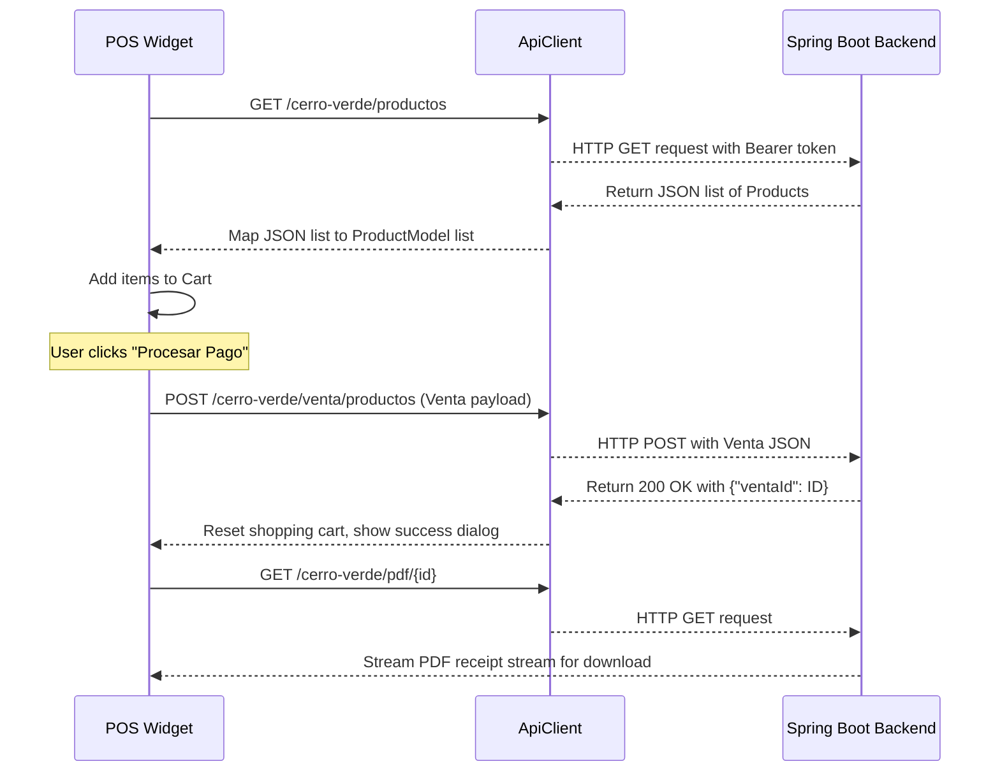

# Technical Design: Connecting Flutter to Spring Boot Backend

This technical design document outlines the architecture, file changes, data flow, and contracts required to connect the Flutter frontend (`hoteleria_erp`) to the Spring Boot backend (`backend-sistema-integral-cerro-verde`).

---

## 1. Technical Approach

The integration implements Spec-Driven Development boundaries by bridging the two projects through standard JSON API contracts. The key objectives are:
1. **Security Handshake**: Replace mock authentication with a Spring Security-based JWT session flow, stored locally in Flutter via `shared_preferences`.
2. **Data Synchronization**: Transition from static UI states to asynchronous endpoints for users, cash registers (caja), transaction listings, and POS sales.
3. **CORS Flexibility**: Establish a robust global CORS configuration on the backend to facilitate smooth Flutter Web development (random port binding) and Android emulator loopbacks (`10.0.2.2`).

---

## 2. Architecture Decisions

### 2.1 Centralized HTTP Client Wrapper (`ApiClient`)
To avoid boilerplates of header injections and error handling in every page/service, a single wrapper class (`ApiClient`) will encapsulate Dart's `http` client. 
- **Header Injection**: Intercepts outgoing requests to append `Authorization: Bearer <jwt_token>` automatically when a token is cached.
- **Session Expiry Hook**: Intercepts all incoming responses. If a `401 Unauthorized` status is received, it triggers a clean logout: purges cached JWT from `shared_preferences`, clears in-memory state, and resets the application route stack to the Login screen.
- **Contextless Navigation**: We will configure a global `GlobalKey<NavigatorState>` in `App` to enable contextless routing redirections inside the HTTP interceptor loop.

### 2.2 Synchronous Pre-Startup Auth Check
Instead of starting the application inside the dashboard and performing page-load checks (which triggers UI flickers), `main.dart` will perform an asynchronous pre-startup check for the cached JWT token.
- If present, the `initialRoute` of the `MaterialApp` will be set directly to `/dashboard`.
- If absent, it redirects directly to `/login`.

### 2.3 Global CORS Policy & OPTIONS Handshake
Spring Security currently secures and restricts endpoints to Angular's development port (`http://localhost:4200`). We will define a global `CorsConfigurationSource` bean inside `SecurityConfig.java` to support wildcard origins (`*`) during local development and ensure preflight `OPTIONS` requests bypass authentication checks without failing.

---

## 3. Data Flow

### 3.1 Startup & Token Verification Flow
```mermaid
sequenceDiagram
    participant User as Flutter Client (App Startup)
    participant Storage as SharedPreferences
    participant Backend as Spring Boot Backend

    User->>Storage: Read "jwt_token"
    alt Token not found
        User->>User: Route to /login
    else Token found
        User->>Backend: GET /cerro-verde/usuario-actual (with Header Bearer)
        alt Response 200 OK
            Backend-->>User: Return User Details (Roles, etc.)
            User->>User: Store details in-memory & Route to /dashboard
        alt Response 401 Unauthorized
            Backend-->>User: Return 401
            User->>Storage: Delete "jwt_token"
            User->>User: Route to /login
        end
    end
```

### 3.2 POS Product Fetching & Sale Submission Flow


---

## 4. File Changes

### 4.1 Frontend (`hoteleria_erp`)
| Path | Action | Description |
|---|---|---|
| `pubspec.yaml` | **Modify** | Add `http: ^1.2.0` and `shared_preferences: ^2.2.0` dependencies. |
| `lib/core/config/constants.dart` | **Create** | Centralized network environment configurations (IP switcher). |
| `lib/core/network/api_client.dart` | **Create** | HTTP wrapper for bearer header injection, exceptions, and `401` redirects. |
| `lib/core/storage/session_storage.dart` | **Create** | Wrapper for setting, reading, and clearing cached JWT tokens. |
| `lib/modulos/seguridad/servicios/auth_service.dart` | **Create** | Handles sign-in API, current-user endpoints, cache state. |
| `lib/modulos/seguridad/servicios/usuario_service.dart` | **Create** | Fetches and manages users list from the backend. |
| `lib/modulos/caja/servicios/caja_service.dart` | **Create** | Handlers for `/caja`, `/aperturar`, `/cerrar`, and `/transacciones` APIs. |
| `lib/modulos/ventas/servicios/pos_service.dart` | **Create** | Retrieves catalog products and posts transaction details. |
| `lib/modulos/seguridad/paginas/pagina_login.dart` | **Create** | Authentication page (credentials form, error handling, redirect to dashboard). |
| `lib/app.dart` | **Modify** | Declare `navigatorKey` for global redirects and register `/login` route. |
| `lib/main.dart` | **Modify** | Pre-load cached token inside `main()` and pass custom `initialRoute` to `MyApp`. |
| `lib/modulos/seguridad/paginas/pagina_usuarios.dart` | **Modify** | Connect widget to `UsuarioService`, fetch and display dynamic users list. |
| `lib/modulos/caja/paginas/pagina_caja.dart` | **Modify** | Connect state hooks to `CajaService` (Aperture state, dynamic list, submit transactions). |
| `lib/modulos/ventas/paginas/pagina_pos.dart` | **Modify** | Pull products catalog from backend and submit sales transaction payload. |

### 4.2 Backend (`backend-sistema-integral-cerro-verde`)
| Path | Action | Description |
|---|---|---|
| `.../config/SecurityConfig.java` | **Modify** | Implement global `CorsConfigurationSource` mapping to all routes (`/**`). |
| `.../controller/reportes/CajaReporteController.java` | **Modify** | Remove controller-level `@CrossOrigin` annotations blocking non-Angular origins. |
| `.../controller/reportes/ReportesVentasController.java` | **Modify** | Remove controller-level `@CrossOrigin` annotations blocking non-Angular origins. |

---

## 5. Interfaces & API Contracts

### 5.1 Authentication Contracts

#### Sign-In
* **URL**: `POST /cerro-verde/generar-token`
* **Request Body**:
  ```json
  {
    "username": "admin",
    "password": "password123"
  }
  ```
* **Response Body (`200 OK`)**:
  ```json
  {
    "token": "eyJhbGciOiJIUzI1NiJ9..."
  }
  ```

#### Current Authenticated User
* **URL**: `GET /cerro-verde/usuario-actual`
* **Headers**: `Authorization: Bearer <jwt_token>`
* **Response Body (`200 OK`)**:
  ```json
  {
    "idUsuario": 1,
    "username": "admin",
    "nombre": "Admin",
    "apellidos": "User",
    "email": "admin@hotel.com",
    "telefono": "987654321",
    "enable": true,
    "perfil": "default.png",
    "rol": {
      "id": 1,
      "nombreRol": "ADMIN",
      "descripcion": "Administrador del Sistema",
      "estado": true
    }
  }
  ```

### 5.2 Users Management Contracts

#### Retrieve Users List
* **URL**: `GET /cerro-verde/usuarios/`
* **Headers**: `Authorization: Bearer <jwt_token>`
* **Response Body (`200 OK`)**:
  ```json
  [
    {
      "idUsuario": 1,
      "username": "admin",
      "nombre": "Admin",
      "apellidos": "User",
      "email": "admin@hotel.com",
      "telefono": "987654321",
      "enable": true,
      "rol": {
        "id": 1,
        "nombreRol": "ADMIN"
      }
    }
  ]
  ```

### 5.3 Cash Register (Caja) Contracts

#### Check Register Status
* **URL**: `GET /cerro-verde/caja`
* **Response Body (`200 OK`)**:
  ```json
  {
    "id": 5,
    "montoApertura": 500.00,
    "montoCierre": null,
    "saldoFisico": 1510.00,
    "saldoTotal": 1510.00,
    "fechaApertura": "2026-06-30T15:00:00.000+00:00",
    "fechaCierre": null,
    "estadoCaja": "abierta"
  }
  ```

#### Open Register
* **URL**: `POST /cerro-verde/caja/aperturar`
* **Request Body**:
  ```json
  {
    "montoApertura": 500.00
  }
  ```
* **Response Body (`200 OK`)**:
  ```json
  {
    "id": 5,
    "montoApertura": 500.00,
    "saldoFisico": 500.00,
    "saldoTotal": 500.00,
    "estadoCaja": "abierta"
  }
  ```

#### Close Register
* **URL**: `POST /cerro-verde/caja/cerrar`
* **Request Body**: `1510.00` *(Double value as raw text/json)*
* **Response Body (`200 OK`)**:
  ```json
  {
    "id": 5,
    "montoApertura": 500.00,
    "montoCierre": 1510.00,
    "saldoFisico": 1510.00,
    "estadoCaja": "cerrada"
  }
  ```

#### Fetch Caja Transactions
* **URL**: `GET /cerro-verde/caja/transacciones`
* **Response Body (`200 OK`)**:
  ```json
  [
    {
      "id": 1,
      "montoTransaccion": 350.00,
      "fechaHoraTransaccion": "2026-06-30T15:30:00.000+00:00",
      "motivo": "Venta #001 - Juan Perez",
      "tipo": {
        "id": 1,
        "nombre": "INGRESO"
      }
    }
  ]
  ```

#### Save Egress / Ingress Transaction
* **URL**: `POST /cerro-verde/caja/transacciones/guardar`
* **Request Body**:
  ```json
  {
    "montoTransaccion": 120.00,
    "motivo": "Compra de insumos",
    "tipo": {
      "id": 2
    }
  }
  ```
* **Response Body (`201 Created`)**: `"Transacción guardada exitosamente"`

### 5.4 POS Contracts

#### List Products
* **URL**: `GET /cerro-verde/productos`
* **Response Body (`200 OK`)**:
  ```json
  [
    {
      "id_producto": 1,
      "nombre": "Coca Cola 500ml",
      "stock": 50,
      "precioVenta": 5.00,
      "categoriaproducto": {
        "id": 1,
        "nombre": "Bebidas"
      }
    }
  ]
  ```

#### Submit Sales
* **URL**: `POST /cerro-verde/venta/productos`
* **Request Body**:
  ```json
  {
    "total": 50.00,
    "descuento": 0.00,
    "cargo": 0.00,
    "igv": 7.63,
    "tipoVenta": "Productos",
    "estadoVenta": "pendiente",
    "sucursal": {
      "id": 1
    },
    "cliente": {
      "id_cliente": 1
    },
    "detalleVenta": [
      {
        "cantidad": 10,
        "precioUnit": 5.00,
        "subTotal": 50.00,
        "producto": {
          "id_producto": 1
        }
      }
    ]
  }
  ```
* **Response Body (`200 OK`)**:
  ```json
  {
    "success": true,
    "mensaje": "Venta de productos registrada exitosamente",
    "ventaId": 142,
    "estado": "pendiente"
  }
  ```

---

## 6. Testing Strategy

### 6.1 Backend API Verification
1. **CORS Validation**: Send HTTP `OPTIONS` requests from arbitrary origins (e.g. `http://localhost:5241`) to verify that the headers `Access-Control-Allow-Origin` match the request source and that they return `200 OK` without requiring authentication headers.
2. **Controller Test Integration**: Verify reporting controllers bypass local ports by querying them using tools like `cURL` or Postman from other domains.

### 6.2 Frontend Client Verification
1. **Persistent Session Tests**: Verify that storing dummy data under `jwt_token` in `shared_preferences` routes directly to the dashboard, and deleting it redirects to the login screen.
2. **401 Interception Verification**: Set up a test interceptor that returns a 401 response and verify that it purges cache storage and launches redirection correctly.

---

## 7. Migration / Rollout

1. **Step 1: Backend Deployment**: Apply the security configurations updates to `SecurityConfig.java` and clean up `@CrossOrigin` constraints on the controllers.
2. **Step 2: Frontend Dependency Setup**: Run `flutter pub get` after registering network packages (`http`, `shared_preferences`).
3. **Step 3: Client Modules Deployment**: Ship helper storage files, networking wrappers, and service classes sequentially. 
4. **Step 4: Page Binding & Testing**: Bind state widgets onto live streams and verify user roles/privileges mapping is working.

---

## 8. Open Questions

1. **Branch Permissions / User Context**: When creating a POS sale or checking Caja, the backend resolves the logged-in user via `SecurityContextHolder.getContext().getAuthentication().getName()`. Does the backend need an explicit branch association from the frontend, or is it inferred automatically from the user's default registered sucursal? 
   * *Resolution*: Under current controller schemas, the backend infers user context. We will stick with this default.
