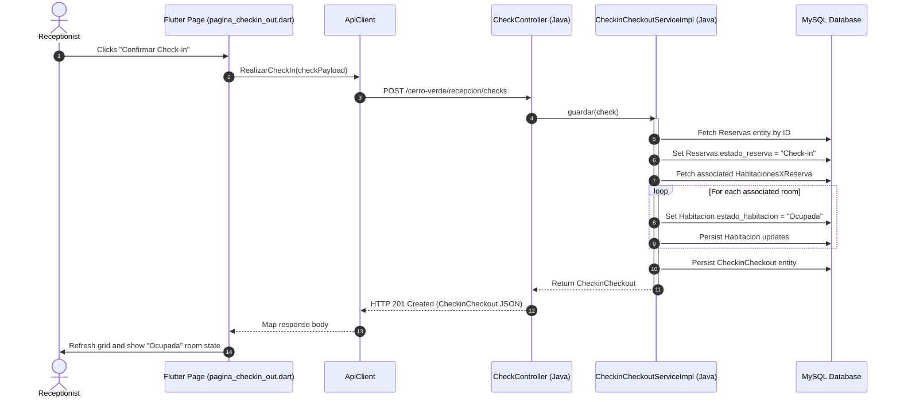

# Technical Design: Connect Reception and Maintenance CRUDs

This document details the architecture, REST contracts, database state transitions, and frontend widgets modifications to connect the hotel reception and maintenance modules of **hoteleria_erp** (Flutter) to **backend-sistema-integral-cerro-verde** (Java Spring Boot).

---

## 1. Technical Approach

The implementation will bridge the mock frontend dashboards with the backend REST APIs. The integration utilizes a symmetrical room-state machine and reference feeds to support dynamic dropdown forms.

### Backend Synchronizations
* **Symmetrical State Machine for Room Occupancy**:
  * **Check-in (`POST /cerro-verde/recepcion/checks`)**: During check-in, the reservation status is updated to `"Check-in"`. All rooms associated with this reservation (`HabitacionesXReserva`) will be updated to `"Ocupada"`.
  * **Check-out (`PUT /cerro-verde/recepcion/checks/{id}`)**: Symmetrical to check-in, check-out sets reservation status to `"Completada"`, transitions rooms to `"Limpieza"`, and inserts new pending records into the `limpiezas` table.
* **New Reference Feed Endpoint**:
  * To list sucursales for the Room creation and Reservation forms, a new REST endpoint `GET /cerro-verde/sucursales` will be exposed using a new controller `SucursalesController.java` mapped to the existing `SucursalesRepository`.

### Frontend Integration
* **Service Layer Integration (Plain Map Decoders)**:
  * Aligned with the existing patterns in `UsuarioService.dart` and `PosService.dart`, all new services under receiving and maintenance modules will return decoded raw JSON objects as `List<Map<String, dynamic>>` or `Map<String, dynamic>`.
* **State Management & UI Control**:
  * We will use local state management (`StatefulWidget`'s `setState`) within pages and modals to fetch and present dynamic list results and handle loading indicators.
* **Referential Deletion Error Guarding**:
  * We will intercept room deletion responses. If a referential integrity violation occurs, the frontend will show a descriptive error dialog instead of crashing.

---

## 2. Architecture Decisions

### AD-01: Exposing Branches via a New Controller
* **Decision**: Create `SucursalesController.java` to expose `GET /cerro-verde/sucursales`.
* **Rationale**: The database contains a `sucursales` table mapped via `Sucursales.java` and `SucursalesRepository.java`, but no endpoint exposes it. Creating a lightweight controller avoids hardcoding branches in frontend dropdowns.

### AD-02: Plain Map JSON Decoders on Frontend
* **Decision**: Flutter service methods will return raw decoded maps (`List<Map<String, dynamic>>`) rather than custom typed model classes.
* **Rationale**: Aligns with the project's existing frontend practices (`PosService.dart`, `UsuarioService.dart`), keeping implementation effort low and matching the local codebase conventions.

---

## 3. Data Flow

### A. Check-in Room Occupancy Flow



### B. Maintenance Tab Isolation

```mermaid
graph TD
    Dashboard[pagina_mantenimiento.dart] --> Tab1[Tab 1: Limpiezas]
    Dashboard --> Tab2[Tab 2: Incidencias]
    
    Tab1 --> FetchL[GET /cerro-verde/limpiezas/ver]
    Tab1 --> UpdateL[PUT /cerro-verde/limpiezas/actualizar/{id}]
    Tab1 --> DropdownStaff[GET /cerro-verde/personallimpieza/ver]
    
    Tab2 --> FetchI[GET /cerro-verde/incidencias/ver]
    Tab2 --> AddI[POST /cerro-verde/incidencias/registrar]
    Tab2 --> DropdownHabs[GET /cerro-verde/recepcion/habitaciones]
    Tab2 --> DropdownTypes[GET /cerro-verde/tipoincidencia/ver]
    Tab2 --> DropdownAreas[GET /cerro-verde/areashotel/ver]
```

---

## 4. File Changes

### Backend changes:
1. **`CheckinCheckoutServiceImpl.java`**: Add logic in `guardar()` to fetch the rooms associated with the check-in reservation and update their state to `"Ocupada"`.
2. **`SucursalesController.java` (New File)**: Expose `GET /cerro-verde/sucursales` by autowiring `SucursalesRepository`.

### Frontend changes:
1. **`lib/modulos/recepcion/servicios/habitacion_service.dart` (New File)**: Expose room CRUD requests and floor/type/branch auxiliary catalogs.
2. **`lib/modulos/recepcion/servicios/reserva_service.dart` (New File)**: Expose reservation CRUD, cancel, and auxiliary dropdown feeds.
3. **`lib/modulos/recepcion/servicios/check_service.dart` (New File)**: Expose check-in/out CRUD requests.
4. **`lib/modulos/recepcion/servicios/huesped_service.dart` (New File)**: Expose guest association requests.
5. **`lib/modulos/mantenimiento/servicios/mantenimiento_service.dart` (New File)**: Expose cleaning tasks, incident management requests, and dropdown catalogs.
6. **`lib/modulos/recepcion/paginas/pagina_habitaciones.dart`**: Load dynamic rooms lists, show loading UI, implement catalog dropdown fetching in modal, and implement try-catch deletion warning.
7. **`lib/modulos/recepcion/paginas/pagina_reservas.dart`**: Load dynamic reservations, wire wizard to backend calls, and bind cancel actions.
8. **`lib/modulos/recepcion/paginas/pagina_checkin_out.dart`**: Load checks, wire check-in modal to backend and check-out to PUT updates.
9. **`lib/modulos/mantenimiento/paginas/pagina_mantenimiento.dart`**: Split dashboard into "Limpiezas" and "Incidencias" tabs, fetch separate endpoints, add dialogs to update states and register incidents.

---

## 5. Interfaces & REST Contracts

### A. New Backend Endpoint
`GET /cerro-verde/sucursales`
* **Response**: `200 OK`
```json
[
  {
    "id": 1,
    "ciudad": "Tarapoto",
    "direccion": "Jr. San Pablo 123"
  }
]
```

### B. Modified Backend Service Logic (`CheckinCheckoutServiceImpl.java`)
```java
@Override
@Transactional
public CheckinCheckout guardar(CheckinCheckout check) {
    if (check == null || check.getReserva() == null) {
        throw new IllegalArgumentException("Datos incompletos para guardar el check-in");
    }

    var reserva = reservaRepository.findById(check.getReserva().getId_reserva())
            .orElseThrow(() -> new IllegalArgumentException("Reserva no encontrada"));

    reserva.setEstado_reserva("Check-in");
    reservaRepository.save(reserva);

    // Transition all associated rooms to "Ocupada"
    List<HabitacionesXReserva> habitaciones = habitacionesReservasRepository.findByReservaId(reserva.getId_reserva());
    for (HabitacionesXReserva hr : habitaciones) {
        hr.getHabitacion().setEstado_habitacion("Ocupada");
        habitacionRepository.save(hr.getHabitacion());
    }

    check.setReserva(reserva);
    return repository.save(check);
}
```

### C. Frontend Service Contracts (Signature Examples)
```dart
// habitacion_service.dart
static Future<List<Map<String, dynamic>>> obtenerHabitaciones();
static Future<Map<String, dynamic>> guardarHabitacion(Map<String, dynamic> body);
static Future<void> eliminarHabitacion(int id); // Catch HTTP exceptions outside

// reserva_service.dart
static Future<List<Map<String, dynamic>>> obtenerReservas();
static Future<void> cancelarReserva(int id);

// check_service.dart
static Future<List<Map<String, dynamic>>> obtenerChecks();
static Future<Map<String, dynamic>> realizarCheckIn(Map<String, dynamic> body);
static Future<Map<String, dynamic>> realizarCheckOut(int id, Map<String, dynamic> body);

// mantenimiento_service.dart
static Future<List<Map<String, dynamic>>> obtenerLimpiezas();
static Future<List<Map<String, dynamic>>> obtenerIncidencias();
static Future<void> actualizarLimpieza(int id, Map<String, dynamic> body);
static Future<Map<String, dynamic>> registrarIncidencia(Map<String, dynamic> body);
```

---

## 6. UI Implementation Design

### 6.1 Habitaciones Page (`pagina_habitaciones.dart`)
* **State Variables**:
  * `List<Map<String, dynamic>> habitaciones = []`
  * `bool cargando = true`
* **Fetch Loop on `initState`**:
  ```dart
  void cargarDatos() async {
    try {
      final data = await HabitacionService.obtenerHabitaciones();
      setState(() {
        habitaciones = data;
        cargando = false;
      });
    } catch (e) {
      setState(() => cargando = false);
      // Display snackbar error
    }
  }
  ```
* **Deletion Deferral & Catching**:
  ```dart
  void eliminarHabitacion(int id) async {
    try {
      await HabitacionService.eliminarHabitacion(id);
      cargarDatos(); // Reload
    } catch (e) {
      showDialog(
        context: context,
        builder: (context) => AlertDialog(
          title: const Text('Error de Eliminación'),
          content: const Text(
            'No se puede eliminar la habitación. Existen registros históricos de reservas o limpiezas asociados a esta habitación.'
          ),
          actions: [
            TextButton(
              onPressed: () => Navigator.pop(context),
              child: const Text('Entendido'),
            ),
          ],
        ),
      );
    }
  }
  ```

### 6.2 Mantenimiento Dashboard (`pagina_mantenimiento.dart`)
* **Widget Structure**:
  ```dart
  DefaultTabController(
    length: 2,
    child: Scaffold(
      appBar: const TabBar(
        tabs: [
          Tab(text: 'Limpiezas', icon: Icon(Icons.cleaning_services)),
          Tab(text: 'Incidencias', icon: Icon(Icons.warning)),
        ],
      ),
      body: TabBarView(
        children: [
          _construirTabLimpiezas(),
          _construirTabIncidencias(),
        ],
      ),
    ),
  )
  ```

---

## 7. Testing Strategy

### Backend Tests
* **Check-in Transaction Isolation**: Verify `CheckinCheckoutService.guardar()` transitions associated rooms status in database to `"Ocupada"`.
* **Branch Feeds**: Ensure `GET /cerro-verde/sucursales` returns all populated sucursales.

### Frontend UI Tests
* **Catalog Dropdown Feeds**: Open room creation form and verify sucursales, floors, and room types query successfully and render dropdown options.
* **Deletion Dialog Alert**: Mock check room delete returning a `500/409` conflict error and assert that the alert warning dialog pops up containing the correct text message.

---

## 8. Migration & Rollout

1. **Database Catalogs Seeding**: Make sure that sucursales, floors, and types tables are seeded with base data.
2. **Compile Backend**: Build the backend using maven and test compilation.
3. **Deploy API updates**: Restart backend server.
4. **Compile Frontend**: Verify Flutter app compilation and test endpoints connectivity.

---

## 9. Open Questions
* *None* - The endpoints, entities, and controller changes map fully to standard JPA configurations.
